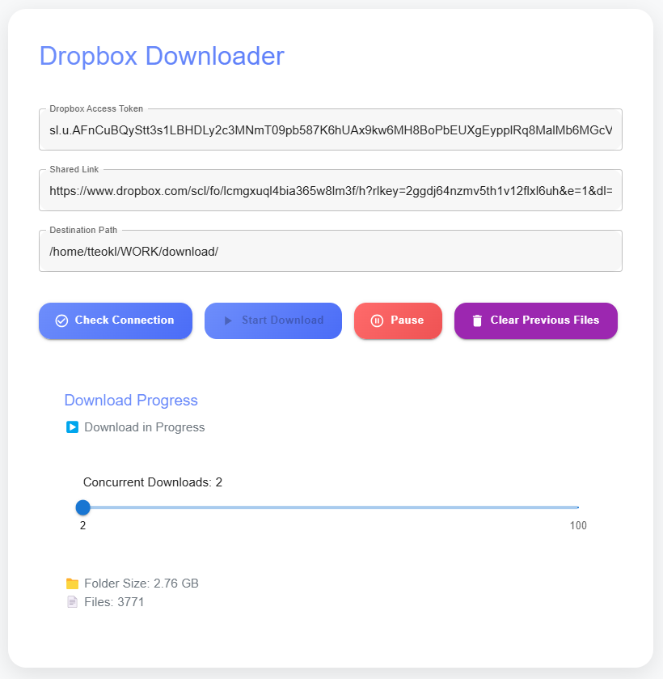

# Dropbox Folder Downloader
<p align="center">
   
</p>

Do you experience this problem when trying to download big folders on Dropbox?

<p align="center">
    
    
</p>

A modern application to efficiently download large Dropbox folders that are typically difficult to download directly from the Dropbox website. Features both a command-line interface and a modern web interface with parallel downloading capabilities.

## Web Interface

For a feature-rich experience with real-time monitoring and controls:

1. Setup and run the web application:
   ```bash
   cd dropbox-downloader-app
   npm install
   npm start
   ```
   See `dropbox-downloader-app/README.md` for detailed setup instructions.

Features include:
- Adjustable parallel downloading (2-100 concurrent downloads)
- Real-time progress monitoring with speed graph
- Dark/Light theme
- English/Korean language support
- Pause/Resume functionality
- Destination folder management

## Command Line Interface

For users who prefer command line usage:

1. Create a `.env` file with:
   ```
   DROPBOX_ACCESS_TOKEN=your_access_token
   SHARED_LINK=your_dropbox_shared_link
   DESTINATION_PATH=local_download_path
   ```

2. Install requirements:
   ```bash
   pip install dropbox python-dotenv requests
   ```

## Usage

- Start downloading: `./run.sh`
- Stop downloading: `./stop.sh`

Both interfaces use multiple download processes with different ordering strategies (normal, reverse, random) to maximize download speed.

Note: Remember to change access key and run again whenever a tmux terminal shows an access key expired error. Since this tool also checks file sizes during iteration, running again helps to scan and ensure no file is incomplete.